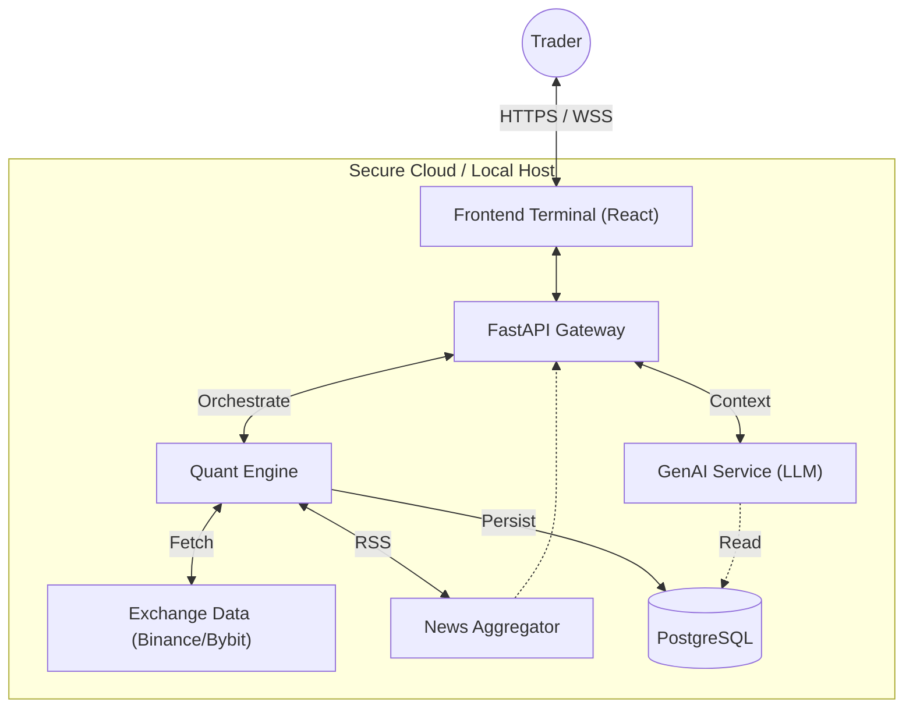

<div align="center">

# 🦅 TraderCopilot
### Institutional Intelligence for the Modern Retail Trader

[](https://github.com/lukx/tradercopilot/actions)
[](LICENSE)
[](https://www.python.org/)
[](https://fastapi.tiangolo.com/)
[](https://reactjs.org/)

[Features](#-key-features) • [Architecture](#-architecture) • [Stack](#-technology-stack) • [Installation](#-getting-started)

</div>

---

## 🚀 Overview

**TraderCopilot** is a high-performance, institutional-grade trading terminal designed to bridge the gap between retail traders and professional hedge fund tools. By merging **Quantitative Finance** engines with **Generative AI** (RAG), it offers real-time market surveillance, automated strategy backtesting, and actionable intelligence in a premium, privacy-focused dashboard.

Unlike standard trading bots, TraderCopilot acts as an intelligent force multiplier—automating the tedious analysis while keeping the human in control of the final execution.

## ✨ Key Features

### 🧠 Hybrid Intelligence Core
- **AI Analyst (RAG)**: Integrates DeepSeek & Gemini models to analyze chart patterns, RSI, MACD, and market structure in real-time.
- **Context-Aware**: The AI doesn't just chat; it "sees" the same data you do, providing mathematically grounded explanations.
- **Smart Tagging**: Automatic classification of assets and news (e.g., BTC, DEFI, REGULATION).

### ⚡ Professional Quant Engine
- **Multi-Strategy Registry**: Concurrent execution of advanced strategies (RSI Divergence, Donchian Breakout, SuperTrend).
- **Real-Time Signal Detection**: Sub-second latency signal generation and evaluation.
- **Backtesting-as-a-Service**: Instant historical validation engine to stress-test strategies before deployment.

### 📰 Live Market Intelligence
- **Institutional News Feed**: Integrated, low-latency financial news feed (Cointelegraph source) with 2-minute auto-refresh.
- **Smart Sentiment**: Automatic analysis of news impact on specific tokens.
- **Zero-Distraction UI**: "Financial Terminal" aesthetic with hover-reveal navigation and focus modes.

### 📱 Adaptive Experience
- **Mobile-First Design**: Fully responsive interface that adapts complex data visualizations for mobile devices.
- **Touch-Optimized**: Native swipe gestures, touch-friendly charts, and adaptive grids.
- **Cross-Platform**: Seamless experience from 27" monitors to 6" smartphones.

## 🛠️ Technology Stack

Built for speed, reliability, and scale.

| Layer | Technology | Highlights |
|-------|------------|------------|
| **Frontend** | React 18 + TypeScript | Vite-powered, TailwindCSS for styling, Recharts for visualization. |
| **Backend** | FastAPI (Python) | High-concurrency async capabilities, Pydantic data validation. |
| **Database** | PostgreSQL / SQLite | Hybrid persistence (SQLite for local dev, Postgres for production). |
| **Infrastructure** | Docker + Railway | Containerized deployment with automated CI/CD pipelines. |
| **Data Ops** | CCXT + NumPy | Unified crypto exchange connector and vectorised calculations. |

## 🏗️ Architecture



## 🏁 Getting Started

### Prerequisites
- Python 3.10+
- Node.js 18+

### Quick Setup

1. **Clone the Repository**
   ```bash
   git clone https://github.com/lukx/tradercopilot.git
   cd tradercopilot
   ```

2. **Backend Initialization**
   ```bash
   cd backend
   python -m venv venv
   # activate venv (source venv/bin/activate or venv\Scripts\activate)
   pip install -r requirements.txt
   cp .env.example .env  # Configure your API keys
   ```

3. **Frontend Initialization**
   ```bash
   cd ../web
   npm install
   npm run dev
   ```

4. **Launch**
   - Backend runs on `http://localhost:8000`
   - Frontend runs on `http://localhost:5173`

## 🔒 Security & Liability

**TraderCopilot** is engineered with a "Local-First" privacy philosophy. API keys and sensitive strategies are preferred to be stored locally or in your private server instance.

> **Disclaimer**: This software is for educational and analytical purposes only. It does not constitute financial advice. Trading cryptocurrency involves substantial risk of loss.

---

<div align="center">
  © 2024 TraderCopilot Team. All Rights Reserved.
</div>
