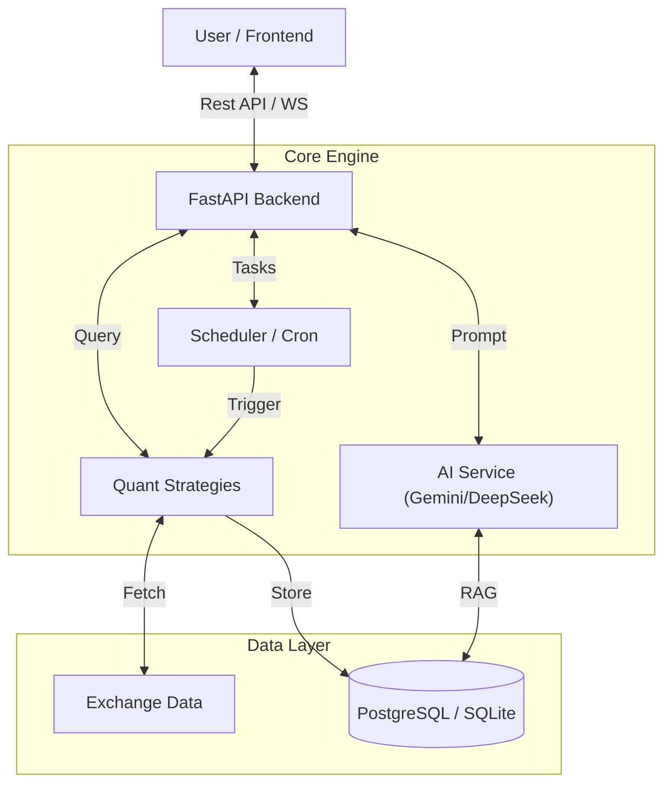

<div align="center">

# 🦅 TraderCopilot
### Institutional Intelligence for Retail Traders

[](https://github.com/lukx/tradercopilot/actions)
[](LICENSE)
[](https://www.python.org/)
[](https://fastapi.tiangolo.com/)
[](https://reactjs.org/)
[](https://github.com/psf/black)

[Features](#-key-features) • [Architecture](#-architecture) • [Getting Started](#-getting-started) • [Deployment](#-deployment)

</div>

---

## 🚀 About

**TraderCopilot** is a next-generation trading intelligence platform that merges **Quantitative Finance** with **Generative AI**. It provides retail traders with the same caliber of tools used by institutional desks—real-time signal detection, automated backtesting, and an AI advisor that explains market moves in plain English.

Built with a **Local-First** philosophy, TraderCopilot ensures your strategies and data remain private while leveraging cloud-grade AI for analysis.

## ✨ Key Features

### 🧠 AI Co-Pilot
- **DeepSeek & Gemini Integration**: Hybrid AI engine for market analysis.
- **RAG Context Awareness**: AI "reads" the chart technicals (RSI, MACD, Bollinger Bands) before answering.
- **Brand Guard**: Built-in safety layers to prevent hallucinations and financial advice liability.

### ⚡ Quant Engine
- **Multi-Strategy Registry**: Run multiple strategies simultaneously (e.g., RSI Divergence, Donchian Breakout, SuperTrend).
- **Real-Time Evaluation**: Signals are generated, tracked, and evaluated for PnL automatically.
- **Backtesting-as-a-Service**: Instant historical validation of strategies before going live.

### 🛡️ Institutional Grade
- **Privacy First**: User strategies and keys originate and stay on your device/server.
- **Robust Architecture**: FastAPI backend with async processing, Rate Limiting, and PostgreSQL/SQLite persistence.
- **Self-Healing**: Automated health checks, circuit breakers, and database migrations.

## 🛠️ Tech Stack

| Component | Technology | Description |
|-----------|------------|-------------|
| **Frontend** | React 18, TypeScript, Vite | High-performance, responsive UI with TailwindCSS. |
| **Backend** | FastAPI, Python 3.10+ | Async API, Pydantic validation, SQLAlchemy ORM. |
| **Database** | PostgreSQL / SQLite | Hybrid persistence layer (SQLite for local, PG for prod). |
| **Data Feed** | CCXT (Binance/Kucoin) | Unified crypto market data interface. |
| **AI LLMs** | Google Gemini / DeepSeek | Context-aware market reasoning engines. |
| **DevOps** | Docker, Railway, GitHub Actions | CI/CD pipelines and containerized deployment. |

## 🏗️ Architecture



## 🏁 Getting Started

### Prerequisites
- **Python 3.10+**
- **Node.js 18+**
- **Git**

### 1. Clone & Setup
```bash
git clone https://github.com/lukx/tradercopilot.git
cd tradercopilot
```

### 2. Backend Setup
```bash
cd backend
python -m venv venv
# Windows
.\venv\Scripts\activate
# Linux/Mac
source venv/bin/activate

pip install -r requirements.txt

# Create .env file
cp .env.example .env
# Edit .env with your keys (GEMINI_API_KEY, etc.)
```

### 3. Frontend Setup
```bash
cd ../web
npm install
npm run dev
```

### 4. Run Locally
Start the backend server:
```bash
# In backend/ directory
uvicorn main:app --reload
```
Access the UI at `http://localhost:5173` and API Docs at `http://localhost:8000/docs`.

## 📦 Deployment

### Railway / Vercel
The project is optimized for **Railway** (Backend) and **Vercel** (Frontend).
- **Backend**: Includes `Procfile` and `runtime.txt`.
- **Database**: Auto-migrates on startup using Alembic/SQLAlchemy.

## ⚠️ Disclaimer

**Trading involves significant risk.** TraderCopilot is a tool for analysis and research. It does not provide financial advice. The creators verify the code integrity but are not responsible for trading losses incurred from using this software.

---

<div align="center">
  Built with ❤️ by the TraderCopilot Team
</div>
