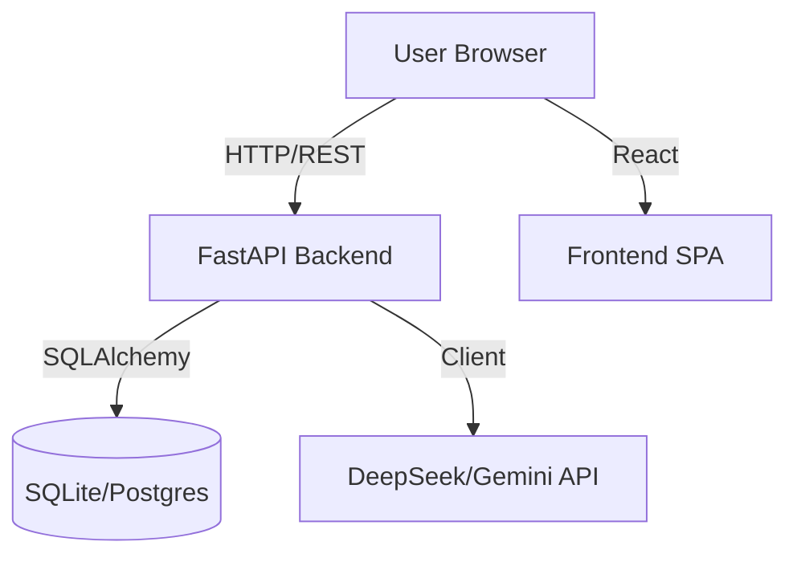

# System Architecture

## Overview
TraderCopilot is a hybrid AI-powered trading assistant.

## detailed Components

### Backend (`/backend`)
-   **FastAPI**: Async web framework.
-   **SQLAlchemy**: ORM for User/Signal management.
-   **Alembic**: Database migrations.
-   **Auth**: JWT-based OAuth2 flow.

### Frontend (`/web`)
-   **React + Vite**: Fast SPA build.
-   **TailwindCSS**: Utility-first styling (Glassmorphism).
-   **Recharts**: Financial charting.

### Data Flow
1.  **Signals**: Ingested via Webhook/API -> Stored in DB -> Served to Dashboard.
2.  **Analysis**: User requests "Ask Copilot" -> Backend fetches context -> AI prompt -> Response.
